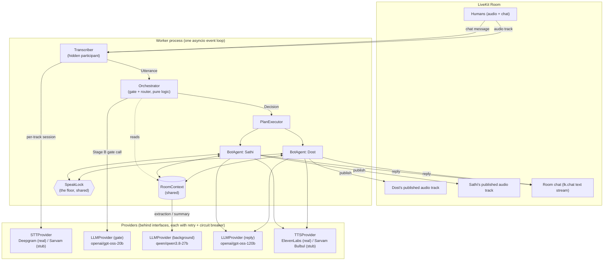
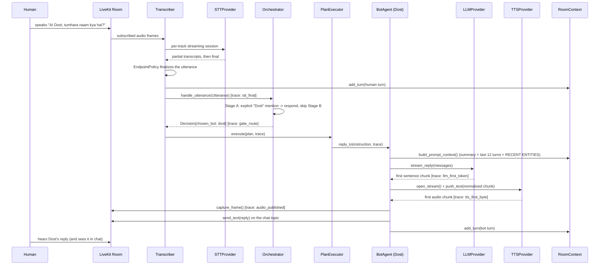
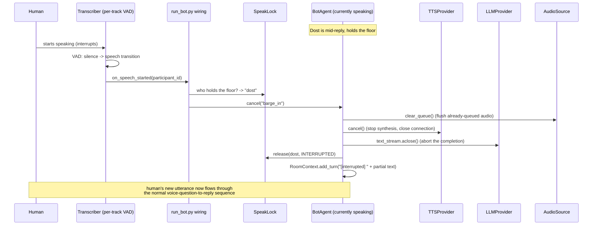
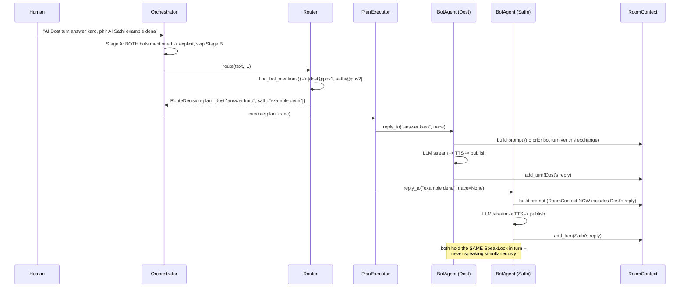
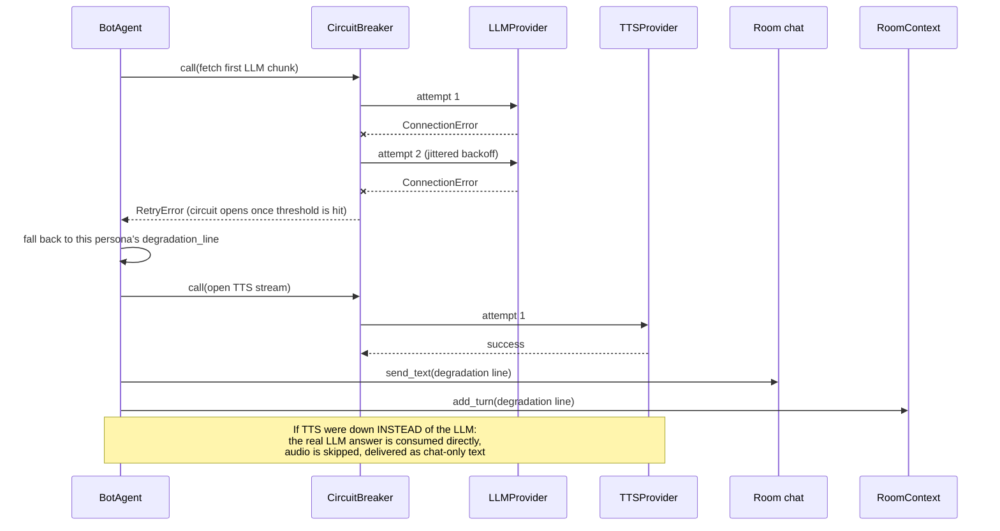

# Architecture

## Component diagram

Three LiveKit connections in one worker process: the Transcriber (hidden participant),
and one connection per BotAgent. The Orchestrator makes no LiveKit connection of its
own -- it's pure decision logic, fed `Utterance`s and returning `Decision`s. RoomContext
and the SpeakLock are shared, in-process state, not services.

Notes on the boundaries:
- **Transcriber** owns one STT+VAD session per subscribed *human* track (bot audio is
  excluded) and also listens on the chat topic -- both become the same `Utterance`
  type, so voice and text share one pipeline from the very first hop.
- **Orchestrator** never touches a BotAgent, TTS, or audio directly. Its only I/O is the
  Stage B gate's small/fast LLM call, and that call is wrapped in retry + circuit
  breaker with a silent fallback (see DECISIONS.md). `LLMGate` and `LLMBackground` are
  deliberately different models/providers -- on Groq, RoomContext's per-turn
  extraction traffic was starving the gate's shared rate-limit budget when both used
  the same model (DECISIONS.md has the full story).
- **RoomContext** is read by the Orchestrator (Stage B context, persona-affinity input)
  and by both BotAgents (prompt building) and written to by the Transcriber (human
  turns) and both BotAgents (bot turns) -- one shared object, not a service with its own
  connection.
- **SpeakLock** is a plain `asyncio.Lock` plus outcome tracking; both BotAgents hold a
  reference to the same instance so only one can synthesize audio at a time.

## Sequence: voice question -> reply

## Sequence: barge-in

## Sequence: two-bot plan

## Sequence: provider failure

## Where each spec requirement lives

| Requirement | Component |
| --- | --- |
| Bots as real, named participants | `BotAgent.connect()`, `config.py`'s `BotIdentity` |
| Per-participant speaker attribution | `transcriber/agent.py` (one STT+VAD session per track) |
| Turn detection / relevance gate | `orchestrator/gate.py` |
| Routing (explicit/multi-bot/affinity/alternation) | `orchestrator/router.py`, `ROUTING.md` |
| Rolling summary + speaker profiles + coreference | `context/room_context.py`, `context/coref.py` |
| Never-both-speaking | `orchestrator/speak_lock.py` |
| Multi-bot sequential execution | `orchestrator/plan_executor.py` |
| Barge-in | `bot_agent.py::cancel()`, `track_pipeline.py`'s `on_speech_started` |
| Script-mixing (Hinglish TTS pronunciation) | `bots/text_normalizer.py`, `personas/_shared.yaml` |
| Reliability (retry/circuit-breaker/fallback) | `reliability/` |
| Tracing + latency | `obs/trace.py`, `obs/latency_report.py` |
